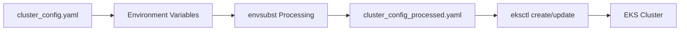

# eksctl Configuration and Template Processing

This document explains how the `cluster_config.yaml` template is processed and used with eksctl to create EKS clusters in the deployment pipeline.

## Overview

The eksctl configuration uses a template-based approach where environment-specific values are injected at deployment time. This allows the same configuration to be used across multiple environments while maintaining environment isolation.

## Template Processing Flow



### Step 1: Template Variables

The `cluster_config.yaml` file contains template variables in the format `${VARIABLE_NAME}`:

```yaml
metadata:
  name: ${CLUSTER_NAME}
  region: ${AWS_REGION}
  version: "${KUBERNETES_VERSION}"
vpc:
  id: ${VPC_ID}
  subnets:
    private:
      ${VPC_AZ_1}:
        id: ${SUBNET_ID_1}
      ${VPC_AZ_2}:
        id: ${SUBNET_ID_2}
```

### Step 2: Environment Variable Resolution

The deployment script (`deploy_eks_cluster.sh`) discovers infrastructure components and sets environment variables:

```bash
# Retrieve VPC ID
export VPC_ID=$(aws ec2 describe-vpcs \
  --filters "Name=tag:Name,Values=${RESOURCE_PREFIX}-vpc" \
  --query 'Vpcs[0].VpcId' --output text)

# Get private subnets
while read -r az subnet; do
  if [[ -z ${VPC_AZ_1:-} ]]; then
    VPC_AZ_1="$az"
    SUBNET_ID_1="$subnet"
  else
    VPC_AZ_2="$az"
    SUBNET_ID_2="$subnet"
  fi
done < <(aws ec2 describe-subnets ...)
```

### Step 3: Template Processing

The `envsubst` command processes the template:

```bash
echo "Processing the cluster config template..."
envsubst < cluster_config.yaml > cluster_config_processed.yaml
```

### Step 4: Cluster Deployment

eksctl uses the processed configuration:

```bash
if aws eks describe-cluster --name "${CLUSTER_NAME}" &>/dev/null; then
  eksctl upgrade cluster -f cluster_config_processed.yaml
else
  eksctl create cluster -f cluster_config_processed.yaml
fi
```

## Configuration Sections

### Cluster Metadata

Defines basic cluster information:

```yaml
metadata:
  name: ${CLUSTER_NAME}          # e.g., "tenant-1-dev-cluster"
  region: ${AWS_REGION}          # e.g., "us-east-1"
  version: "${KUBERNETES_VERSION}" # e.g., "1.32"
  tags:
    karpenter.sh/discovery: ${CLUSTER_NAME}
    map-migrated: ${MAP_MIGRATED}
```

**Key Points:**
- Cluster name follows pattern: `{tenant-id}-{environment}-cluster`
- Karpenter discovery tag enables node auto-provisioning
- map-migrated tag supports AWS MAP program

### VPC Configuration

Specifies networking setup:

```yaml
vpc:
  id: ${VPC_ID}
  subnets:
    private:
      ${VPC_AZ_1}:
        id: ${SUBNET_ID_1}
      ${VPC_AZ_2}:
        id: ${SUBNET_ID_2}
  sharedNodeSecurityGroup: ${SG_ID}
  manageSharedNodeSecurityGroupRules: true
```

**Key Points:**
- Uses existing VPC created in earlier pipeline stage
- Only private subnets for worker nodes (security best practice)
- Shared security group allows inter-node communication
- eksctl manages security group rules automatically

### IAM and OIDC Configuration

Sets up identity and access management:

```yaml
iam:
  withOIDC: true
  serviceAccounts:
  - metadata:
      name: aws-load-balancer-controller
      namespace: kube-system
    wellKnownPolicies:
      awsLoadBalancerController: true
  
  podIdentityAssociations:
  - namespace: "kube-system"
    serviceAccountName: karpenter
    roleName: ${CLUSTER_NAME}-karpenter
    permissionPolicyARNs:
    - arn:aws:iam::${TARGET_ACCOUNT_ID}:policy/KarpenterControllerPolicy-${CLUSTER_NAME}
```

**Key Points:**
- OIDC enables IAM Roles for Service Accounts (IRSA)
- Well-known policies provide pre-configured IAM permissions
- Pod Identity Associations (newer alternative to IRSA)
- Service-specific IAM roles for security isolation

### IAM Identity Mappings

Maps AWS IAM entities to Kubernetes RBAC:

```yaml
iamIdentityMappings:
  - arn: arn:aws:iam::${TARGET_ACCOUNT_ID}:role/${CLUSTER_ADMIN_ROLE_NAME}
    groups:
      - system:masters
    username: admin
    noDuplicateARNs: true
  
  - arn: arn:aws:iam::${TARGET_ACCOUNT_ID}:role/${CODE_BUILD_ROLE_NAME}
    groups:
      - system:masters
    username: codebuild-eks
```

**Key Points:**
- Maps IAM roles to Kubernetes groups
- `system:masters` provides cluster-admin privileges
- CodeBuild role enables pipeline automation
- `noDuplicateARNs` prevents shadowing issues

### Managed Node Groups

Defines worker node configuration:

```yaml
managedNodeGroups:
  - name: system-ng
    labels: { role: system }
    instanceType: m5.xlarge
    amiFamily: AmazonLinux2
    desiredCapacity: 2
    minSize: 1
    maxSize: 4
    privateNetworking: true
```

**Key Points:**
- System node group hosts core Kubernetes services
- Private networking for security
- Auto-scaling configuration
- Node labels for workload targeting

### Add-ons Configuration

Specifies EKS managed add-ons:

```yaml
addons:
- name: vpc-cni
  version: v1.19.3-eksbuild.1
  attachPolicyARNs:
    - arn:aws:iam::aws:policy/AmazonEKS_CNI_Policy

- name: aws-ebs-csi-driver
  wellKnownPolicies:
    ebsCSIController: true

- name: amazon-cloudwatch-observability
  version: latest
  attachPolicyARNs:
    - arn:aws:iam::aws:policy/CloudwatchAgentServerPolicy
```

**Key Points:**
- Managed add-ons are AWS-maintained
- Automatic updates and security patches
- Built-in IAM policy associations
- Version management through eksctl

### CloudWatch Logging

Configures control plane logging:

```yaml
cloudWatch:
  clusterLogging:
    enableTypes: ["audit", "authenticator", "scheduler", "api", "controllerManager"]
    logRetentionInDays: 14
```

**Key Points:**
- Comprehensive control plane logging
- 14-day retention for cost optimization
- Audit logs for security compliance
- API server logs for troubleshooting

## Environment Variables Reference

### Required Variables

| Variable | Source | Description |
|----------|--------|-------------|
| `CLUSTER_NAME` | Pipeline config | EKS cluster name |
| `AWS_REGION` | Target account | AWS region |
| `KUBERNETES_VERSION` | Pipeline config | K8s version |
| `TARGET_ACCOUNT_ID` | Target account | AWS account ID |
| `VPC_ID` | Infrastructure discovery | VPC identifier |
| `SUBNET_ID_1/2` | Infrastructure discovery | Private subnet IDs |
| `VPC_AZ_1/2` | Infrastructure discovery | Availability zones |
| `SG_ID` | Infrastructure discovery | Security group ID |

### Optional Variables

| Variable | Default | Description |
|----------|---------|-------------|
| `MAP_MIGRATED` | From tags | AWS MAP migration tag |
| `CLUSTER_ADMIN_ROLE_NAME` | Config | Admin role name |
| `CODE_BUILD_ROLE_NAME` | Generated | CodeBuild role name |

## Infrastructure Discovery Process

The deployment script automatically discovers infrastructure components:

### VPC Discovery
```bash
export VPC_ID=$(aws ec2 describe-vpcs \
  --filters "Name=tag:Name,Values=${RESOURCE_PREFIX}-vpc" \
  --query 'Vpcs[0].VpcId' --output text)
```

### Subnet Discovery
```bash
aws ec2 describe-subnets \
  --filters "Name=vpc-id,Values=$VPC_ID" \
           "Name=tag:Name,Values=*PrivateSubnet*" \
  --query 'sort_by(Subnets,&AvailabilityZone)[].[AvailabilityZone,SubnetId]' \
  --output text
```

### Security Group Discovery
```bash
export SG_ID=$(aws ec2 describe-security-groups \
  --filters Name=group-name,Values="${RESOURCE_PREFIX}-eks-sg" \
  --query 'SecurityGroups[0].GroupId' \
  --output text)
```

## Error Handling and Validation

### Pre-deployment Checks

The script validates infrastructure availability:

```bash
# Check if required infrastructure exists
if [[ -z "$VPC_ID" || "$VPC_ID" == "None" ]]; then
  echo "Error: VPC not found"
  exit 1
fi

if [[ -z "$SUBNET_ID_1" || -z "$SUBNET_ID_2" ]]; then
  echo "Error: Required subnets not found"
  exit 1
fi
```

### Deployment Strategy

The script handles both new deployments and updates:

```bash
if aws cloudformation describe-stacks \
  --stack-name "eksctl-${CLUSTER_NAME}-cluster" \
  --region "${AWS_REGION}" &>/dev/null; then
  
  if aws eks describe-cluster \
    --name "${CLUSTER_NAME}" \
    --region "${AWS_REGION}" &>/dev/null; then
    echo "Upgrading existing cluster..."
    eksctl upgrade cluster -f cluster_config_processed.yaml
  else
    echo "Creating new cluster..."
    eksctl create cluster -f cluster_config_processed.yaml
  fi
else
  echo "Creating new cluster and stack..."
  eksctl create cluster -f cluster_config_processed.yaml
fi
```

## Best Practices

### Template Organization
1. **Consistent Naming**: Use descriptive variable names
2. **Environment Isolation**: Separate variables by environment
3. **Version Control**: Track template changes
4. **Validation**: Test templates before deployment

### Security Considerations
1. **Private Networking**: All worker nodes in private subnets
2. **IAM Principle of Least Privilege**: Minimal required permissions
3. **Encryption**: Enable encryption for EBS volumes and secrets
4. **Network Policies**: Implement pod-to-pod security

### Operational Excellence
1. **Monitoring**: Enable comprehensive logging
2. **Backup Strategy**: Regular cluster state backups
3. **Update Strategy**: Plan for Kubernetes version updates
4. **Disaster Recovery**: Document recovery procedures

This template-driven approach ensures consistent, repeatable, and secure EKS cluster deployments across multiple environments while maintaining the flexibility to customize configurations per environment.
