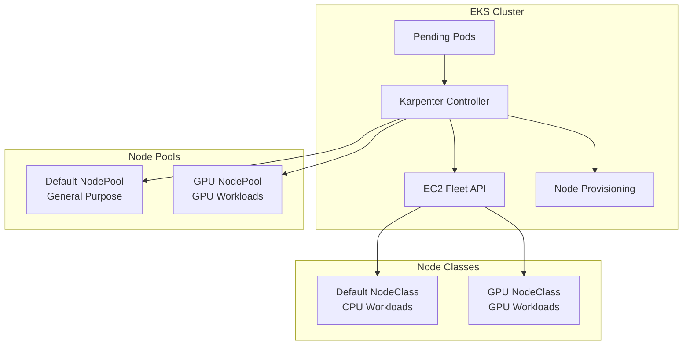

# Karpenter Configuration and Node Provisioning

This document explains how Karpenter is configured and deployed as part of the EKS cluster setup to provide efficient, just-in-time node provisioning.

## Overview

Karpenter is a Kubernetes cluster autoscaler that provisions right-sized compute resources in response to changing application load. Unlike the traditional Cluster Autoscaler, Karpenter doesn't rely on node groups and can provision diverse instance types to optimize cost and performance.

## Architecture



## Installation Process

### 1. CloudFormation Stack Deployment

Before cluster creation, Karpenter's CloudFormation stack is deployed:

```bash
# Download Karpenter CloudFormation template
curl -fsSL \
  "https://raw.githubusercontent.com/aws/karpenter-provider-aws/v${KARPENTER_VERSION}/website/content/en/preview/getting-started/getting-started-with-karpenter/cloudformation.yaml" \
  > karpenter-stack.yaml

# Deploy the stack
aws cloudformation deploy \
  --stack-name "Karpenter-${CLUSTER_NAME}" \
  --template-file karpenter-stack.yaml \
  --capabilities CAPABILITY_NAMED_IAM \
  --parameter-overrides "ClusterName=${CLUSTER_NAME}"
```

**What this creates:**
- Karpenter Node IAM Role
- Karpenter Controller IAM Role  
- Instance Profile for EC2 nodes
- SQS Queue for Spot interruption handling

### 2. Helm Chart Installation

After cluster creation, Karpenter is installed via Helm:

```bash
helm upgrade --install karpenter oci://public.ecr.aws/karpenter/karpenter \
  --version "${KARPENTER_VERSION}" \
  --namespace kube-system \
  --set settings.clusterName="${CLUSTER_NAME}" \
  --set settings.interruptionQueue="${CLUSTER_NAME}" \
  --set controller.resources.requests.cpu=1 \
  --set controller.resources.requests.memory=1Gi \
  --set controller.resources.limits.cpu=1 \
  --set controller.resources.limits.memory=1Gi \
  --wait
```

**Key Configuration:**
- **Cluster Name**: Links Karpenter to the specific EKS cluster
- **Interruption Queue**: Handles Spot instance interruptions
- **Resource Limits**: Ensures Karpenter controller stability

## Node Classes Configuration

Node Classes define the EC2 instance configuration template that Karpenter uses when provisioning nodes.

### Default Node Class (CPU Workloads)

**File:** `scripts/karpenter/ec2nodeclass.yaml`

```yaml
apiVersion: karpenter.k8s.aws/v1
kind: EC2NodeClass
metadata:
  name: default
spec:
  amiFamily: AL2                              # Amazon Linux 2
  role: "KarpenterNodeRole-${CLUSTER_NAME}"   # IAM role for nodes
  
  # Subnet selection using tags
  subnetSelectorTerms:
    - tags:
        karpenter.sh/discovery: "${CLUSTER_NAME}"
  
  # Security group selection
  securityGroupSelectorTerms:
    - tags:
        kubernetes.io/cluster/${CLUSTER_NAME}: "owned"
  
  # AMI selection
  amiSelectorTerms:
    - id: "${AMD_AMI_ID}"                     # Latest optimized AMI
  
  # Storage configuration
  blockDeviceMappings:
    - deviceName: "/dev/xvda"
      ebs:
        volumeSize: "100Gi"
        volumeType: "gp3"
```

**Key Features:**
- Uses latest EKS-optimized Amazon Linux 2 AMI
- 100GB GP3 storage for general workloads
- Automatic subnet and security group discovery
- Inherits VPC and cluster configuration

### GPU Node Class (AI/ML Workloads)

**File:** `scripts/karpenter/ec2nodeclass-gpu.yaml`

```yaml
apiVersion: karpenter.k8s.aws/v1
kind: EC2NodeClass
metadata:
  name: gpu-nodeclass
spec:
  amiFamily: AL2
  role: "KarpenterNodeRole-${CLUSTER_NAME}"
  
  subnetSelectorTerms:
    - tags:
        karpenter.sh/discovery: "${CLUSTER_NAME}"
  
  securityGroupSelectorTerms:
    - tags:
        kubernetes.io/cluster/${CLUSTER_NAME}: "owned"
  
  amiSelectorTerms:
    - id: "${GPU_AMI_ID}"                     # GPU-optimized AMI
  
  blockDeviceMappings:
    - deviceName: /dev/xvda
      ebs:
        volumeSize: "200Gi"                   # Larger storage for GPU workloads
        volumeType: "gp3"
```

**Key Differences:**
- Uses GPU-optimized EKS AMI with NVIDIA drivers
- 200GB storage for larger AI/ML datasets
- Targets GPU-enabled instance families

## Node Pools Configuration

Node Pools define the constraints and requirements for node provisioning.

### Default Node Pool

**File:** `scripts/karpenter/nodepool-default.yaml`

```yaml
apiVersion: karpenter.sh/v1
kind: NodePool
metadata:
  name: default
spec:
  template:
    spec:
      requirements:
        - key: kubernetes.io/os
          operator: In
          values: ["linux"]                   # Linux only
        
        - key: karpenter.sh/capacity-type
          operator: In
          values: ["on-demand"]               # On-demand instances
        
        - key: kubernetes.io/arch
          operator: In
          values: ["amd64"]                   # x86_64 architecture
        
        - key: karpenter.k8s.aws/instance-category
          operator: In
          values: ["c", "m", "r"]             # Compute, Memory, General purpose
        
        - key: karpenter.k8s.aws/instance-cpu
          operator: In
          values: ["4", "8"]                  # 4 or 8 vCPUs
      
      nodeClassRef:
        group: karpenter.k8s.aws
        kind: EC2NodeClass
        name: default                         # References default NodeClass
      
      expireAfter: Never                      # Nodes don't auto-expire
  
  limits:
    cpu: 1000                                 # Max 1000 vCPUs total
  
  disruption:
    consolidationPolicy: WhenEmptyOrUnderutilized
    consolidateAfter: 1m                      # Consolidate after 1 minute
```

**Scheduling Logic:**
- Prioritizes cost-effective instance types (c, m, r families)
- Limits to 4-8 vCPU instances for consistent performance
- Enables consolidation to reduce costs
- Sets cluster-wide CPU limits

### GPU Node Pool

**File:** `scripts/karpenter/nodepool-gpu.yaml`

```yaml
apiVersion: karpenter.sh/v1
kind: NodePool
metadata:
  name: gpu
spec:
  template:
    metadata:
      labels:
        eks-node: "gpu"                       # Node label for scheduling
        nvidia.com/mps.capable: "true"       # Multi-Process Service support
        feature.node.kubernetes.io/pci-10de.present: "true"  # NVIDIA PCI device
        feature.node.kubernetes.io/cpu-model.vendor_id: "NVIDIA"
    
    spec:
      requirements:
        - key: kubernetes.io/os
          operator: In
          values: ["linux"]
        
        - key: karpenter.sh/capacity-type
          operator: In
          values: ["on-demand"]
        
        - key: kubernetes.io/arch
          operator: In
          values: ["amd64"]
        
        - key: karpenter.k8s.aws/instance-family
          operator: In
          values: ["g4dn"]                    # GPU instance family
        
        - key: karpenter.k8s.aws/instance-size
          operator: In
          values: ["12xlarge"]                # Large GPU instances
      
      nodeClassRef:
        group: karpenter.k8s.aws
        kind: EC2NodeClass
        name: gpu-nodeclass
      
      expireAfter: Never
      
      taints:
        - key: "nvidia.com/gpu"               # Taint prevents non-GPU workloads
          value: "true"
          effect: "NoSchedule"
  
  disruption:
    consolidationPolicy: WhenEmptyOrUnderutilized
    consolidateAfter: 1m
```

**GPU-Specific Features:**
- Restricts to GPU instance families (g4dn)
- Adds taints to ensure only GPU workloads are scheduled
- Labels nodes for GPU feature detection
- Supports NVIDIA Multi-Process Service (MPS) for GPU sharing

## AMI Management

The deployment script automatically retrieves the latest EKS-optimized AMIs:

```bash
# Get ARM64 AMI ID
export ARM_AMI_ID="$(aws ssm get-parameter \
  --name "/aws/service/eks/optimized-ami/${KUBERNETES_VERSION}/amazon-linux-2-arm64/recommended/image_id" \
  --query Parameter.Value \
  --output text)"

# Get x86_64 AMI ID  
export AMD_AMI_ID="$(aws ssm get-parameter \
  --name "/aws/service/eks/optimized-ami/${KUBERNETES_VERSION}/amazon-linux-2/recommended/image_id" \
  --query Parameter.Value \
  --output text)"

# Get GPU AMI ID
export GPU_AMI_ID="$(aws ssm get-parameter \
  --name "/aws/service/eks/optimized-ami/${KUBERNETES_VERSION}/amazon-linux-2-gpu/recommended/image_id" \
  --query Parameter.Value \
  --output text)"
```

**Benefits:**
- Always uses latest security patches
- Automatic compatibility with Kubernetes version
- Consistent configuration across environments

## NVIDIA Device Plugin Configuration

For GPU workloads, the NVIDIA Device Plugin is installed with time-slicing support:

```bash
# Create ConfigMap for GPU time slicing
cat <<EOF | kubectl apply -f -
apiVersion: v1
kind: ConfigMap
metadata:
  name: nvidia-device-plugin
  namespace: kube-system
data:
  any: |-
    version: v1
    flags:
      migStrategy: none
    sharing:
      timeSlicing:
        resources:
        - name: nvidia.com/gpu
          replicas: 10                        # Allow 10 pods per GPU
EOF

# Install NVIDIA Device Plugin
helm upgrade --install nvdp nvdp/nvidia-device-plugin \
  --namespace kube-system \
  --version "${NVIDIA_DEVICE_PLUGIN_VERSION}" \
  --set config.name=nvidia-device-plugin \
  --set timeSlicing.enabled=true \
  --set nodeSelector."eks-node"=gpu \
  --force
```

**Time Slicing Benefits:**
- Multiple pods can share a single GPU
- Better resource utilization for development workloads
- Cost optimization for GPU-intensive applications

## Node Provisioning Flow

### 1. Pod Scheduling

When a pod is created that cannot be scheduled on existing nodes:

```yaml
apiVersion: v1
kind: Pod
metadata:
  name: gpu-workload
spec:
  containers:
  - name: tensorflow
    image: tensorflow/tensorflow:latest-gpu
    resources:
      limits:
        nvidia.com/gpu: 1                    # Requests GPU resource
  tolerations:
  - key: nvidia.com/gpu                     # Tolerates GPU taint
    operator: Equal
    value: "true"
    effect: NoSchedule
  nodeSelector:
    eks-node: gpu                           # Targets GPU nodes
```

### 2. Karpenter Decision Logic

Karpenter evaluates:
1. **Resource Requirements**: CPU, memory, GPU, storage
2. **Node Constraints**: Instance types, availability zones
3. **Cost Optimization**: Cheapest instance that meets requirements
4. **Scheduling Constraints**: Taints, tolerations, node selectors

### 3. Instance Provisioning

Karpenter provisions the most suitable instance:
- **For CPU workloads**: m5.large, c5.xlarge, r5.2xlarge, etc.
- **For GPU workloads**: g4dn.xlarge, g4dn.2xlarge, g4dn.12xlarge
- **Mixed workloads**: Provisions multiple instance types as needed

### 4. Node Registration

New nodes automatically:
1. Join the EKS cluster using bootstrap script
2. Register with Kubernetes API server
3. Become available for pod scheduling
4. Apply node labels and taints from NodePool

## Monitoring and Observability

### Karpenter Metrics

Key metrics to monitor:

```yaml
# Karpenter Controller Metrics
karpenter_nodes_created_total              # Total nodes created
karpenter_nodes_terminated_total           # Total nodes terminated
karpenter_provisioner_scheduling_duration  # Time to schedule pods
karpenter_nodes_allocatable               # Available node capacity

# Node Pool Metrics
karpenter_nodepool_usage                  # Resource usage by pool
karpenter_nodepool_limit                  # Resource limits by pool
```

### CloudWatch Integration

The deployment enables comprehensive logging:

```yaml
# In cluster_config.yaml
cloudWatch:
  clusterLogging:
    enableTypes: ["audit", "authenticator", "scheduler", "api", "controllerManager"]
    logRetentionInDays: 14
```

### Custom Dashboards

Monitor Karpenter performance with Grafana dashboards:
- Node provisioning latency
- Instance type distribution
- Cost optimization metrics
- Resource utilization trends

## Cost Optimization Strategies

### 1. Instance Diversification

Karpenter automatically selects cost-effective instances:

```yaml
# NodePool allows multiple instance types
requirements:
  - key: karpenter.k8s.aws/instance-category
    operator: In
    values: ["c", "m", "r"]                 # Mix of compute types
  
  - key: karpenter.k8s.aws/instance-cpu
    operator: In  
    values: ["4", "8", "16"]                # Various CPU sizes
```

### 2. Consolidation

Automatic node consolidation reduces costs:

```yaml
disruption:
  consolidationPolicy: WhenEmptyOrUnderutilized
  consolidateAfter: 1m                      # Quick consolidation
```

### 3. Spot Instance Support

For cost-sensitive workloads, enable Spot instances:

```yaml
requirements:
  - key: karpenter.sh/capacity-type
    operator: In
    values: ["spot", "on-demand"]           # Mix of instance types
```

### 4. Resource Limits

Prevent runaway scaling with limits:

```yaml
limits:
  cpu: 1000                                 # Maximum cluster CPU
  memory: 1000Gi                           # Maximum cluster memory
```

## Troubleshooting

### Common Issues

#### 1. Nodes Not Provisioning

**Symptoms:**
- Pods stuck in Pending state
- No new nodes created

**Debugging:**
```bash
# Check Karpenter logs
kubectl logs -n kube-system -l app.kubernetes.io/name=karpenter

# Check NodePool configuration
kubectl describe nodepool default

# Verify IAM permissions
aws sts get-caller-identity
```

**Common Causes:**
- Insufficient IAM permissions
- No available subnets in AZ
- Instance type not available
- Resource limits exceeded

#### 2. GPU Nodes Not Working

**Symptoms:**
- GPU pods not scheduled
- NVIDIA drivers not found

**Debugging:**
```bash
# Check NVIDIA device plugin
kubectl get pods -n kube-system | grep nvidia

# Verify GPU availability
kubectl describe nodes -l eks-node=gpu

# Check device plugin configuration
kubectl get configmap nvidia-device-plugin -n kube-system -o yaml
```

#### 3. High Costs

**Symptoms:**
- Unexpectedly high EC2 costs
- Many large instances running

**Investigation:**
```bash
# Check node utilization
kubectl top nodes

# Review instance types
kubectl get nodes -o custom-columns=NAME:.metadata.name,INSTANCE:.metadata.labels.node\.kubernetes\.io/instance-type

# Analyze consolidation opportunities
kubectl describe nodepool default | grep -A 10 disruption
```

### Performance Tuning

#### 1. Faster Provisioning

```yaml
# Reduce consolidation delay for faster scaling
disruption:
  consolidationPolicy: WhenEmpty           # Only consolidate empty nodes
  consolidateAfter: 30s                    # Faster consolidation
```

#### 2. Instance Type Optimization

```yaml
# Target specific instance families for workload
requirements:
  - key: karpenter.k8s.aws/instance-family
    operator: In
    values: ["m5", "m5n", "m5dn"]          # Optimized for network performance
```

#### 3. Availability Zone Balancing

```yaml
# Spread nodes across AZs
requirements:
  - key: topology.kubernetes.io/zone
    operator: In
    values: ["us-east-1a", "us-east-1b", "us-east-1c"]
```

## Security Considerations

### 1. IAM Least Privilege

Karpenter nodes use minimal required permissions:

```json
{
  "Version": "2012-10-17",
  "Statement": [
    {
      "Effect": "Allow",
      "Action": [
        "ec2:CreateLaunchTemplate",
        "ec2:CreateTags",
        "ec2:DescribeInstances",
        "ec2:RunInstances",
        "ec2:TerminateInstances"
      ],
      "Resource": "*",
      "Condition": {
        "StringEquals": {
          "aws:RequestedRegion": "${AWS::Region}"
        }
      }
    }
  ]
}
```

### 2. Network Security

All Karpenter-provisioned nodes:
- Launch in private subnets only
- Use cluster security groups
- Follow VPC network policies
- Support Istio service mesh

### 3. Image Security

- Uses only EKS-optimized AMIs
- Automatic security patch updates
- Container image scanning enabled
- Runtime security with Falco (optional)

## Best Practices

### 1. Resource Planning

- Set appropriate resource limits per NodePool
- Monitor utilization trends
- Plan for peak capacity requirements
- Use multiple NodePools for workload isolation

### 2. Cost Management

- Enable Spot instances for fault-tolerant workloads
- Set up cost alerts and budgets
- Regular review of instance type usage
- Implement resource quotas per namespace

### 3. Operational Excellence

- Monitor Karpenter controller health
- Set up alerts for provisioning failures
- Regular testing of node provisioning
- Document custom configurations

### 4. Workload Optimization

- Use appropriate resource requests/limits
- Implement pod disruption budgets
- Design for node failures
- Use horizontal pod autoscaling

This comprehensive Karpenter setup provides efficient, cost-effective, and secure node provisioning for both CPU and GPU workloads while maintaining operational simplicity through automation.
