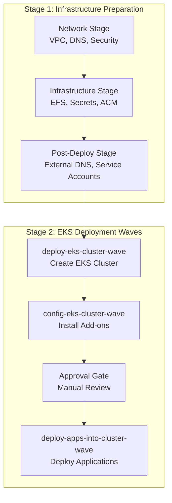

# CDK Pipeline Waves and Deployment Strategy

This document explains the wave-based deployment strategy used in the CDK pipeline for orchestrating EKS cluster deployment and application installation.

## Overview

AWS CDK Pipelines use "waves" to organize deployment steps into logical groups that can execute in parallel or sequence. This approach provides:

- **Dependency Management**: Ensures proper order of operations
- **Parallelization**: Runs independent tasks simultaneously for faster deployments
- **Error Isolation**: Limits failure impact to specific deployment phases
- **Manual Controls**: Enables human approval gates where needed

## Wave Architecture



## Pipeline Stages vs Waves

### Stages (Sequential)
CDK Stages represent major deployment phases that must complete before the next begins:

```python
# Network Stage - Must complete first
network_stage = NetworkStage(...)
pipeline.add_stage(network_stage)

# Infrastructure Stage - Depends on network
infra_stage = InfraStage(...)
pipeline.add_stage(infra_stage)

# Post-Deploy Stage - Depends on infrastructure
post_deploy_stage = PostDeployStage(...)
pipeline.add_stage(post_deploy_stage)
```

### Waves (Within Stages)
Waves organize CodeBuild steps within or between stages:

```python
# Wave 1: Deploy EKS Cluster
deploy_eks_cluster = pipeline.add_wave("deploy-eks-cluster-wave")
deploy_eks_cluster.add_post(
    pipelines.CodeBuildStep("deploy-eks-cluster-step", ...)
)

# Wave 2: Configure EKS Cluster  
config_eks_cluster = pipeline.add_wave("config-eks-cluster-wave")
config_eks_cluster.add_post(
    pipelines.CodeBuildStep("config-eks-cluster-step", ...)
)
```

## Wave 1: EKS Cluster Deployment

### Purpose
Creates the core EKS cluster infrastructure using eksctl.

### CodeBuild Configuration

```python
deploy_eks_cluster.add_post(
    pipelines.CodeBuildStep(
        "deploy-eks-cluster-step",
        project_name=f"{props.resource_prefix}-deploy-eks-cluster",
        build_environment=codebuild.BuildEnvironment(
            build_image=codebuild.LinuxBuildImage.STANDARD_7_0
        ),
        commands=[
            "cd scripts/cluster_config",
            "chmod +x deploy_eks_cluster.sh", 
            "./deploy_eks_cluster.sh",
        ],
        env={
            "AWS_REGION": props.target_account.region,
            "CLUSTER_ACCESS_ROLE_ARN": cluster_access_role_arn,
            "CLUSTER_NAME": f"{props.resource_prefix}-cluster",
            "KUBERNETES_VERSION": props.kubernetes_version,
            "KARPENTER_VERSION": props.karpenter_version,
            # ... additional environment variables
        },
        role=codebuild_role,
    )
)
```

### Key Activities

1. **Cross-Account Role Assumption**
   ```bash
   CREDS_JSON="$(aws sts assume-role \
     --role-arn "${CLUSTER_ACCESS_ROLE_ARN}" \
     --role-session-name "AddonsCrossAcctSession")"
   ```

2. **Infrastructure Discovery**
   ```bash
   export VPC_ID=$(aws ec2 describe-vpcs \
     --filters "Name=tag:Name,Values=${RESOURCE_PREFIX}-vpc" \
     --query 'Vpcs[0].VpcId' --output text)
   ```

3. **Karpenter Stack Deployment**
   ```bash
   aws cloudformation deploy \
     --stack-name "Karpenter-${CLUSTER_NAME}" \
     --template-file karpenter-cloudformation.yaml
   ```

4. **EKS Cluster Creation**
   ```bash
   envsubst < cluster_config.yaml > cluster_config_processed.yaml
   eksctl create cluster -f cluster_config_processed.yaml
   ```

5. **OIDC Configuration Storage**
   ```bash
   aws ssm put-parameter \
     --name "${OIDC_ID_PARAM}" \
     --value "${OIDC_ID}"
   ```

### Error Handling

The script includes comprehensive error handling:

```bash
set -e  # Exit on any error

# Validate required variables
if [[ -z "$CLUSTER_NAME" ]]; then
  echo "Error: CLUSTER_NAME not set"
  exit 1
fi

# Check cluster state before action
if aws eks describe-cluster --name "${CLUSTER_NAME}" &>/dev/null; then
  echo "Cluster exists, upgrading..."
  eksctl upgrade cluster -f cluster_config_processed.yaml
else
  echo "Creating new cluster..."
  eksctl create cluster -f cluster_config_processed.yaml
fi
```

## Wave 2: EKS Cluster Configuration

### Purpose
Installs and configures essential cluster add-ons and prepares for workloads.

### CodeBuild Configuration

```python
config_eks_cluster.add_post(
    pipelines.CodeBuildStep(
        "config-eks-cluster-step",
        project_name=f"{props.resource_prefix}-config-eks-cluster",
        commands=[
            "cd scripts/cluster_config",
            "chmod +x config_eks_cluster.sh",
            "./config_eks_cluster.sh",
        ],
        env={
            "ACM_CERTIFICATE_ARN": props.path_builder.get_ssm_path("acm", "certificate-arn"),
            "EFS_FILE_SYSTEM_PARAM": props.path_builder.get_ssm_path("efs", "file-system-id"),
            "EXTERNAL_DNS_ROLE": external_dns_role_arn,
            "EXTERNAL_DNS_SA_ROLE": external_dns_sa_role_arn,
            "EXTERNAL_SECRETS_SA_ROLE": external_secrets_sa_role_arn,
            # ... additional configurations
        },
        role=codebuild_role,
    )
)
```

### Configuration Sequence

1. **Kubectl Setup**
   ```bash
   aws eks update-kubeconfig --name "${CLUSTER_NAME}"
   ```

2. **Storage Classes Creation**
   ```bash
   # EFS Storage Class
   kubectl apply -f - <<EOF
   apiVersion: storage.k8s.io/v1
   kind: StorageClass
   metadata:
     name: efs-sc
   provisioner: efs.csi.aws.com
   EOF
   ```

3. **Namespace Creation with Security Policies**
   ```bash
   create_namespace_with_istio() {
     local namespace=$1
     kubectl apply -f - <<EOF
     apiVersion: v1
     kind: Namespace
     metadata:
       name: ${namespace}
       labels:
         istio-injection: enabled
         pod-security.kubernetes.io/audit: baseline
   EOF
   }
   ```

4. **Karpenter Installation**
   ```bash
   helm upgrade --install karpenter oci://public.ecr.aws/karpenter/karpenter \
     --version "${KARPENTER_VERSION}" \
     --namespace kube-system \
     --set settings.clusterName="${CLUSTER_NAME}"
   ```

5. **Add-on Installation**
   - AWS Load Balancer Controller
   - ExternalDNS  
   - External Secrets Operator
   - NVIDIA Device Plugin (for GPU)

### Parallel Add-on Installation

Some add-ons can be installed in parallel using background processes:

```bash
# Start installations in background
helm install aws-load-balancer-controller ... &
LOAD_BALANCER_PID=$!

helm install external-dns ... &
EXTERNAL_DNS_PID=$!

helm install external-secrets ... &
EXTERNAL_SECRETS_PID=$!

# Wait for all installations to complete
wait $LOAD_BALANCER_PID
wait $EXTERNAL_DNS_PID  
wait $EXTERNAL_SECRETS_PID
```

## Manual Approval Wave (Optional)

### Purpose
Provides human oversight before application deployment in production environments.

### Configuration

```python
if props.enable_manual_approval:
    approval_stage = pipeline.add_wave("eks-cluster-approval-wave")
    approval_stage.add_pre(
        pipelines.ManualApprovalStep(
            "eks-cluster-approval-step",
            comment="Approve EKS cluster configuration before app deployment?",
        )
    )
```

### SNS Notification Setup

```python
# Create SNS topic for notifications
approval_topic = sns.Topic(
    self,
    "EKSClusterApprovalTopic",
    display_name=f"{props.resource_prefix}-eks-cluster-approval",
)

# Add email subscriptions
for email in props.email_subscriptions:
    approval_topic.add_subscription(
        subscriptions.EmailSubscription(email)
    )

# Create notification rule
notifications.NotificationRule(
    self,
    "notification-rule",
    events=[
        "codepipeline-pipeline-manual-approval-needed",
        "codepipeline-pipeline-pipeline-execution-failed",
        "codepipeline-pipeline-pipeline-execution-succeeded"
    ],
    targets=[approval_topic],
    source=pipeline.pipeline,
)
```

### Approval Process

1. **Pipeline Pause**: Execution stops at approval step
2. **Email Notification**: Stakeholders receive approval request
3. **Manual Review**: Team reviews cluster configuration
4. **Approval Decision**: Approve/reject via AWS Console or CLI
5. **Pipeline Continuation**: Next wave starts after approval

## Wave 3: Application Deployment

### Purpose
Deploys applications and sets up GitOps workflows.

### CodeBuild Configuration

```python
deploy_apps_into_cluster.add_post(
    pipelines.CodeBuildStep(
        "deploy-apps-into-cluster-step",
        project_name=f"{props.resource_prefix}-deploy-apps-into-cluster",
        commands=[
            "cd scripts/cluster_config",
            "chmod +x deploy_apps_into_cluster.sh",
            "./deploy_apps_into_cluster.sh",
        ],
        env={
            "APP_DOMAIN": f"{props.resource_prefix}.{props.hosted_zone_name}",
            "PRODUCTS_PURCHASED": ",".join(props.products_purchased),
            "KEYCLOAK_ADMIN_CREDENTIALS": f"/{props.tenant_id}/{props.target_env}/keycloak/admin-credentials",
            # ... additional environment variables
        },
        role=codebuild_role,
    )
)
```

### Application Deployment Sequence

1. **GitOps Repository Setup**
   ```bash
   # Clone application configuration repository
   git clone https://github.com/${GITHUB_OWNER}/argocd-app-config.git
   
   # Create environment-specific branch
   NEW_BRANCH="develop/${RESOURCE_PREFIX}"
   git checkout -b "${NEW_BRANCH}"
   ```

2. **Configuration Processing**
   ```bash
   # Update application configurations with environment variables
   find . -name 'applicationset.yaml' | while read -r file; do
     envsubst '${RESOURCE_PREFIX} ${APP_DOMAIN} ${CERTIFICATE_ARN}' < "${file}" > "${file}.tmp"
     mv "${file}.tmp" "${file}"
   done
   ```

3. **ArgoCD Application Deployment**
   ```bash
   # Deploy prerequisite services
   kubectl apply -f projects
   
   # Deploy Istio application set
   kubectl apply -f ./istio/istio-app/applicationset.yaml
   
   # Deploy product-specific applications
   for product in "${PURCHASED_PRODUCTS[@]}"; do
     kubectl apply -f "${product}/${product}-app/applicationset.yaml"
   done
   ```

4. **Observability Stack Installation**
   ```bash
   # Install Prometheus and Grafana
   helm upgrade --install prometheus prometheus-community/kube-prometheus-stack \
     --namespace observability \
     -f observability/prometheus-values.yaml
   
   # Install Loki for log aggregation  
   helm upgrade --install loki grafana/loki-distributed \
     --namespace observability \
     -f observability/loki-values.yaml
   ```

### Application Health Checks

The deployment includes health checks to ensure services are ready:

```bash
# Wait for ArgoCD to be ready
kubectl wait --for=condition=Ready pod -l app.kubernetes.io/name=argocd-server \
  -n argocd --timeout=300s

# Wait for Istio Gateway to be ready
kubectl wait --for=condition=Ready pod -l app=istio-gateway \
  -n istio-system --timeout=300s

# Verify application endpoints
curl -f https://${APP_DOMAIN}/health || exit 1
```

## Error Handling and Recovery

### Wave-Level Error Isolation

Each wave includes comprehensive error handling:

```bash
set -e  # Exit on error
set -u  # Exit on undefined variable
set -o pipefail  # Exit on pipe failure

# Function for error handling
handle_error() {
  local exit_code=$?
  echo "Error occurred in wave ${CODEBUILD_BUILD_ID} at line $1"
  echo "Exit code: ${exit_code}"
  
  # Cleanup resources if needed
  cleanup_on_error
  
  exit ${exit_code}
}

trap 'handle_error ${LINENO}' ERR
```

### Retry Logic

Critical operations include retry mechanisms:

```bash
retry_command() {
  local max_attempts=3
  local delay=30
  local attempt=1
  
  while [ $attempt -le $max_attempts ]; do
    if "$@"; then
      return 0
    else
      echo "Attempt $attempt failed. Retrying in ${delay}s..."
      sleep $delay
      ((attempt++))
    fi
  done
  
  echo "Command failed after $max_attempts attempts"
  return 1
}

# Example usage
retry_command helm install karpenter ...
```

### Rollback Procedures

Each wave documents rollback procedures:

```bash
rollback_cluster_config() {
  echo "Rolling back cluster configuration..."
  
  # Remove problematic add-ons
  helm uninstall external-dns -n external-dns || true
  
  # Restore previous configuration
  kubectl apply -f backup/previous-config.yaml
  
  # Verify cluster health
  kubectl get nodes
  kubectl get pods -A
}
```

## Performance Optimization

### Parallel Execution

Where possible, operations run in parallel:

```bash
# Start multiple installations simultaneously
{
  echo "Installing AWS Load Balancer Controller..."
  helm install aws-load-balancer-controller ...
} &

{
  echo "Installing ExternalDNS..."
  helm install external-dns ...
} &

{
  echo "Installing External Secrets Operator..."
  helm install external-secrets ...
} &

# Wait for all background jobs to complete
wait
echo "All installations completed"
```

### Resource Optimization

CodeBuild projects use appropriate instance sizes:

```python
build_environment=codebuild.BuildEnvironment(
    build_image=codebuild.LinuxBuildImage.STANDARD_7_0,
    compute_type=codebuild.ComputeType.MEDIUM,  # Adequate for most operations
    privileged=True,  # Required for Docker operations
)
```

### Caching Strategies

Build steps leverage caching for faster execution:

```bash
# Cache Docker images
docker pull nginx:latest
docker pull postgres:13

# Cache Helm charts
helm repo add stable https://charts.helm.sh/stable
helm repo update

# Cache kubectl binaries
curl -LO "https://dl.k8s.io/release/v${KUBERNETES_VERSION}/bin/linux/amd64/kubectl"
chmod +x kubectl
```

## Monitoring and Observability

### Pipeline Metrics

CloudWatch metrics track pipeline performance:

- Wave execution duration
- Success/failure rates
- Resource utilization
- Cost per deployment

### Logging Strategy

Each wave produces structured logs:

```bash
# Structured logging function
log_info() {
  echo "$(date -u +"%Y-%m-%dT%H:%M:%SZ") [INFO] $1"
}

log_error() {
  echo "$(date -u +"%Y-%m-%dT%H:%M:%SZ") [ERROR] $1" >&2
}

# Usage
log_info "Starting EKS cluster deployment"
log_error "Failed to create cluster: ${error_message}"
```

### Health Checks

Post-deployment validation ensures system health:

```bash
validate_deployment() {
  log_info "Validating deployment health..."
  
  # Check cluster connectivity
  kubectl cluster-info || return 1
  
  # Verify essential pods
  kubectl get pods -n kube-system | grep -E "(coredns|aws-load-balancer-controller)" || return 1
  
  # Test application endpoints
  curl -f "https://${APP_DOMAIN}/health" || return 1
  
  log_info "Deployment validation successful"
}
```

This wave-based approach provides a robust, scalable, and maintainable deployment strategy that can handle complex EKS cluster deployments while providing clear separation of concerns and comprehensive error handling. ee ee a
